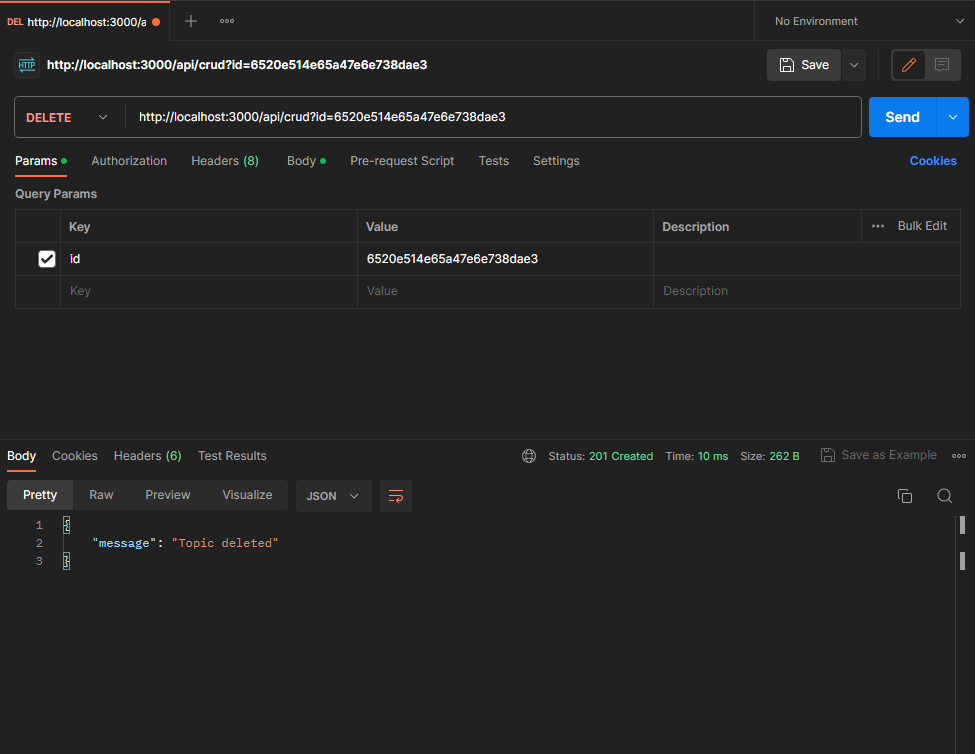

This is a [Next.js](https://nextjs.org/) project bootstrapped with [`create-next-app`](https://github.com/vercel/next.js/tree/canary/packages/create-next-app).

## Basic crud with next.js 13 and mongoDB


## Setup

I am using local mongodb with compass
and postman to test api
make .env or .env.local file and paste 
```text
    MONGODB_URI="mongodb://127.0.0.1:27017/crud_db"
```

 ## getting start

```text
    npm run dev
```
# adding data to database
<p align="center">
  
</p>

# reading data from database
<p align="center">
  
</p>

# delete data from database
<p align="center">
  
</p>

# update data from database
<p align="center">
  
</p>

